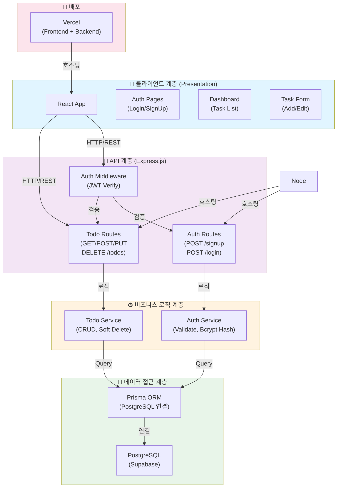
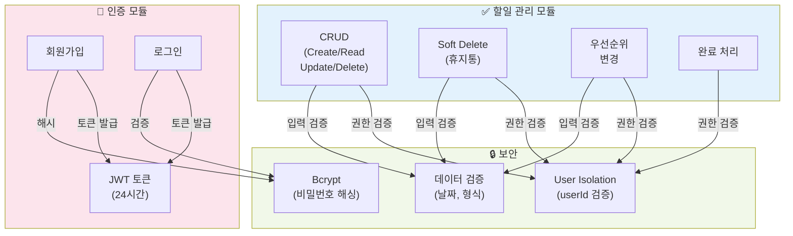
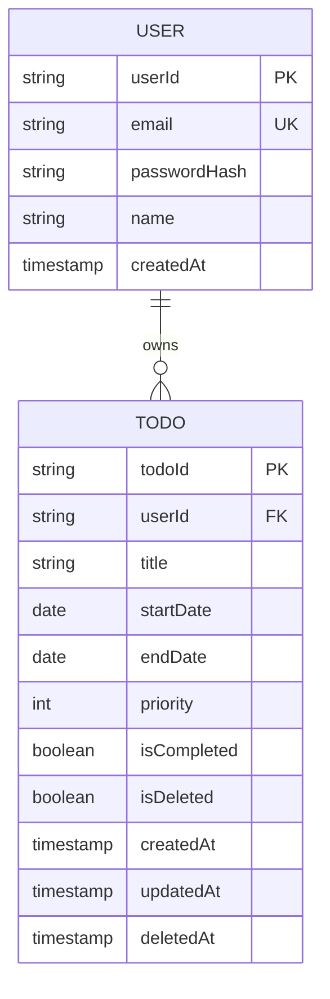
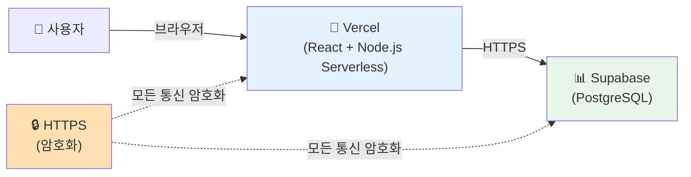

# ToDoToDoToDo 기술 아키텍처 다이어그램

## 시스템 아키텍처 (4계층)



## 데이터 플로우

```mermaid
graph LR
    User["👤 사용자"]
    Browser["🌐 브라우저<br/>(React)"]
    APIServer["🔧 API 서버<br/>(Express)"]
    DB["📊 데이터베이스<br/>(PostgreSQL)"]
    Cache["💾 JWT Token"]

    User -->|상호작용| Browser
    Browser -->|1. HTTP Request<br/>+ JWT Token| APIServer
    APIServer -->|2. 검증<br/>(권한/데이터)| APIServer
    APIServer -->|3. 쿼리| DB
    DB -->|4. 데이터| APIServer
    APIServer -->|5. JSON Response| Browser
    Browser -->|6. 렌더링| User
    APIServer -->|JWT 생성| Cache
    Browser -->|저장| Cache

    style User fill:#ffebee
    style Browser fill:#e1f5ff
    style APIServer fill:#f3e5f5
    style DB fill:#e8f5e9
    style Cache fill:#fff3e0
```

## 핵심 모듈별 아키텍처



## 데이터베이스 스키마 (간략)



## 배포 아키텍처



## 요청/응답 사이클 (예: 할일 조회)

```mermaid
sequenceDiagram
    participant User as 👤 사용자
    participant Frontend as 🌐 React
    participant API as 🔧 Express API
    participant Prisma as 📦 Prisma ORM
    participant DB as 💾 PostgreSQL

    User->>Frontend: 할일 목록 조회 클릭
    Frontend->>API: GET /todos<br/>(JWT Token)
    API->>API: JWT 검증
    API->>API: userId 확인
    API->>Prisma: getTodos(userId)
    Prisma->>DB: SELECT * FROM todos<br/>WHERE userId=? AND isDeleted=false
    DB-->>Prisma: 결과
    Prisma-->>API: Todo 객체 배열
    API-->>Frontend: JSON Response (200 OK)
    Frontend->>Frontend: 상태 업데이트
    Frontend->>User: 할일 목록 렌더링

    style User fill:#ffebee
    style Frontend fill:#e1f5ff
    style API fill:#f3e5f5
    style Prisma fill:#fff3e0
    style DB fill:#e8f5e9
```

---

**문서 버전**: 1.0
**작성일**: 2025-11-26
**설명**: ToDoToDoToDo 프로젝트의 기술 아키텍처를 시각화한 다이어그램
**참고**: 단순한 구조로 핵심 컴포넌트와 데이터 플로우만 표시
