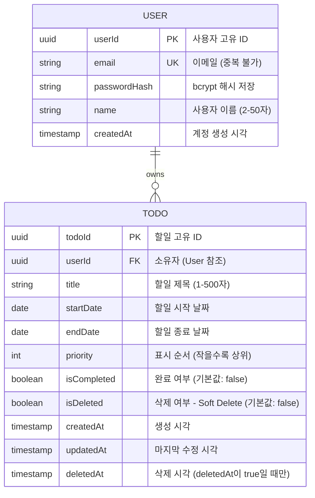

# ToDoToDoToDo 데이터베이스 ERD (Entity Relationship Diagram)

## 개요

ToDoToDoToDo 프로젝트의 데이터베이스 스키마를 시각화한 ERD입니다. 사용자와 할일 간의 관계, 각 엔티티의 속성, 제약조건을 정의합니다.

**참고 문서:**
- [1-domain-definition.md](./1-domain-definition.md) - 도메인 정의 및 엔티티 상세
- [3-prd.md](./3-prd.md) - 기능 요구사항
- [5-project-structure.md](./5-project-structure.md) - 설계 원칙

---

## 1. 엔티티 관계도 (ER Diagram)



---

## 2. 엔티티 상세 정의

### 2.1 USER (사용자)

**목적**: 애플리케이션의 사용자 정보 관리

**참고**: 데이터베이스의 컬럼명은 lowercase로 저장됨 (userId → userid, passwordHash → passwordhash 등)

| 속성 (ERD) | DB 컬럼명 | 데이터 타입 | 제약조건 | 설명 |
|----------|----------|-----------|--------|------|
| `userId` | `userid` | UUID | PK | 사용자 고유 식별자 |
| `email` | `email` | String(255) | UK, NOT NULL | RFC 5322 형식, 중복 불가 |
| `passwordHash` | `passwordhash` | String(100) | NOT NULL | bcrypt로 해시된 비밀번호 (8자 이상) |
| `name` | `name` | String(50) | NOT NULL | 사용자 이름 (2-50자) |
| `createdAt` | `createdat` | DateTime | NOT NULL, DEFAULT | ISO 8601 형식, 자동 생성 |

**인덱스:**
- `email` (UNIQUE): 로그인 시 이메일 조회 성능
- `userId` (PRIMARY): 고유 식별 및 FK 참조

**검증 규칙:**
- 이메일: RFC 5322 형식 필수
- 비밀번호: 8자 이상, 영문/숫자/특수문자 조합 필수
- 이름: 2-50자

---

### 2.2 TODO (할일)

**목적**: 사용자의 할일 항목 관리

**참고**: 데이터베이스의 컬럼명은 lowercase로 저장됨 (todoId → todoid, startDate → startdate 등)

| 속성 (ERD) | DB 컬럼명 | 데이터 타입 | 제약조건 | 설명 |
|----------|----------|-----------|--------|------|
| `todoId` | `todoid` | UUID | PK | 할일 고유 식별자 |
| `userId` | `userid` | UUID | FK, NOT NULL | 소유자 (User.userid 참조) |
| `title` | `title` | String(500) | NOT NULL | 할일 제목 (1-500자) |
| `startDate` | `startdate` | Date | NOT NULL | 할일 시작 날짜 (YYYY-MM-DD) |
| `endDate` | `enddate` | Date | NOT NULL | 할일 종료 날짜 (YYYY-MM-DD) |
| `priority` | `priority` | Integer | NOT NULL, DEFAULT | 표시 순서 (작을수록 상위, 기본값: 999999) |
| `isCompleted` | `iscompleted` | Boolean | NOT NULL, DEFAULT | 완료 여부 (기본값: false) |
| `isDeleted` | `isdeleted` | Boolean | NOT NULL, DEFAULT | 삭제 여부 - Soft Delete (기본값: false) |
| `createdAt` | `createdat` | DateTime | NOT NULL, DEFAULT | 생성 시각 (자동) |
| `updatedAt` | `updatedat` | DateTime | NOT NULL, DEFAULT | 마지막 수정 시각 (자동) |
| `deletedAt` | `deletedat` | DateTime | NULLABLE | 삭제 시각 (isDeleted=true일 때만 값 보유) |

**인덱스:**
- `userId` (B-tree): 사용자별 할일 조회
- `isDeleted` (B-tree): Soft Delete 필터링
- `isCompleted` (B-tree): 완료/진행중 분류
- `(userId, isDeleted, isCompleted)` (복합): 쿼리 최적화

**검증 규칙:**
- 제목: 1-500자 (필수)
- 시작일 ≤ 종료일 (필수)
- priority: 1 이상 999999 이하 (정수)
- userId는 반드시 User 테이블에 존재 (외래키 제약)

**상태 정의:**

| 상태 | isCompleted | isDeleted | 설명 |
|------|-----------|----------|------|
| 진행중 | false | false | 활성 상태이며 아직 완료되지 않음 |
| 완료 | true | false | 활성 상태이며 완료됨 |
| 휴지통 | (무관) | true | 삭제됨 (복원 가능) |

---

## 3. 관계 정의

### USER ↔ TODO: 1:N (일대다)

**관계 유형**: One-to-Many (1:N)

- 한 명의 사용자는 **여러 개의 할일**을 소유 가능
- 한 개의 할일은 **정확히 한 명의 사용자**에게만 소속

**외래키 제약:**
```sql
ALTER TABLE todo ADD CONSTRAINT fk_todo_user
FOREIGN KEY (userId) REFERENCES user(userId);
```

**CASCADE 규칙**: 사용자 삭제 시 해당 사용자의 모든 할일도 삭제 (선택사항, 비즈니스 정책에 따라)

**데이터 무결성:**
- 모든 할일은 반드시 유효한 userId를 가져야 함
- 다른 사용자의 할일에 대한 접근 차단 (애플리케이션 레벨)

---

## 4. 데이터베이스 설계 특징

### 4.1 Soft Delete (논리적 삭제)

**원칙**: 데이터를 물리적으로 삭제하지 않고 `isDeleted` 플래그로 표시

**구현:**
```sql
-- 할일 삭제 (Soft Delete)
UPDATE todo SET isDeleted = true, deletedAt = NOW()
WHERE todoId = ? AND userId = ?;

-- 활성 할일만 조회
SELECT * FROM todo
WHERE userId = ? AND isDeleted = false;

-- 휴지통 할일만 조회
SELECT * FROM todo
WHERE userId = ? AND isDeleted = true;

-- 할일 복원
UPDATE todo SET isDeleted = false, deletedAt = NULL
WHERE todoId = ? AND userId = ?;

-- 영구 삭제 (Hard Delete)
DELETE FROM todo
WHERE todoId = ? AND userId = ? AND isDeleted = true;
```

**장점:**
- 실수로 삭제한 데이터 즉시 복구 가능
- 삭제 이력 추적 용이 (deletedAt)
- 백업 없이 복구 가능

**주의사항:**
- 모든 SELECT 쿼리에 `isDeleted = false` 조건 필수
- 데이터베이스 용량 증가 (정기적인 영구 삭제 필요)

### 4.2 사용자 격리 (User Isolation)

**원칙**: 모든 할일 접근 시 `userId` 검증 필수

**구현:**
```sql
-- userId 검증을 포함한 조회
SELECT * FROM todo
WHERE todoId = ? AND userId = ? AND isDeleted = false;

-- userId 검증을 포함한 수정
UPDATE todo SET title = ?, startDate = ?, endDate = ?
WHERE todoId = ? AND userId = ? AND isDeleted = false;

-- userId 검증을 포함한 삭제
UPDATE todo SET isDeleted = true, deletedAt = NOW()
WHERE todoId = ? AND userId = ? AND isDeleted = false;
```

**보안:** SQL 인젝션 방지를 위해 Prepared Statement 사용 (Prisma ORM)

### 4.3 인덱싱 전략

**인덱스 목록:**

| 인덱스명 | 테이블 | 컬럼 (DB) | 유형 | 목적 | 상태 |
|---------|-------|------|------|------|------|
| user_pkey | user | userid | PRIMARY | 고유 식별 | ✅ 생성됨 |
| user_email_key | user | email | UNIQUE | 이메일 중복 방지 | ✅ 생성됨 |
| idx_user_email | user | email | B-tree | 로그인 시 이메일 조회 | ✅ 생성됨 |
| idx_todo_userid | todo | userid | B-tree | 사용자별 할일 조회 | ✅ 생성됨 |
| idx_todo_isdeleted | todo | isdeleted | B-tree | Soft Delete 필터링 | ✅ 생성됨 |
| idx_todo_iscompleted | todo | iscompleted | B-tree | 완료/진행중 분류 | ✅ 생성됨 |
| idx_todo_composite | todo | (userid, isdeleted, iscompleted) | 복합 | 종합 조회 최적화 | ✅ 생성됨 |
| idx_todo_dates | todo | (startdate, enddate) | 복합 | 날짜 범위 조회 | ✅ 생성됨 |

**성능 목표:**
- DB 쿼리: 50ms 이내
- API 응답: 500ms 이내

---

## 5. 데이터 샘플

### User 테이블 샘플

| userId | email | passwordHash | name | createdAt |
|--------|-------|--------------|------|-----------|
| 550e8400-e29b-41d4-a716-446655440000 | john@example.com | $2b$10$... (bcrypt) | John Doe | 2025-11-26T10:00:00Z |
| 550e8400-e29b-41d4-a716-446655440001 | jane@example.com | $2b$10$... (bcrypt) | Jane Smith | 2025-11-26T11:30:00Z |

### TODO 테이블 샘플

| todoId | userId | title | startDate | endDate | priority | isCompleted | isDeleted | createdAt | updatedAt | deletedAt |
|--------|--------|-------|-----------|---------|----------|-------------|-----------|-----------|-----------|-----------|
| 660e8400-e29b-41d4-a716-446655440000 | 550e8400-e29b-41d4-a716-446655440000 | 프로젝트 설계 | 2025-11-26 | 2025-11-27 | 1 | false | false | 2025-11-26T10:15:00Z | 2025-11-26T10:15:00Z | NULL |
| 660e8400-e29b-41d4-a716-446655440001 | 550e8400-e29b-41d4-a716-446655440000 | 백엔드 개발 | 2025-11-27 | 2025-11-28 | 2 | false | false | 2025-11-26T10:20:00Z | 2025-11-26T10:20:00Z | NULL |
| 660e8400-e29b-41d4-a716-446655440002 | 550e8400-e29b-41d4-a716-446655440000 | 테스트 | 2025-11-29 | 2025-11-29 | 3 | true | false | 2025-11-26T10:25:00Z | 2025-11-26T14:00:00Z | NULL |
| 660e8400-e29b-41d4-a716-446655440003 | 550e8400-e29b-41d4-a716-446655440000 | 배포 | 2025-11-30 | 2025-11-30 | 4 | false | true | 2025-11-26T10:30:00Z | 2025-11-26T15:00:00Z | 2025-11-26T15:00:00Z |

---

## 6. Prisma Schema 참고

```prisma
model User {
  userId    String   @id @default(cuid())
  email     String   @unique
  passwordHash String
  name      String
  createdAt DateTime @default(now())

  todos     Todo[]   @relation("UserTodos")
}

model Todo {
  todoId      String   @id @default(cuid())
  userId      String
  user        User     @relation("UserTodos", fields: [userId], references: [userId])

  title       String
  startDate   DateTime
  endDate     DateTime
  priority    Int      @default(999999)
  isCompleted Boolean  @default(false)
  isDeleted   Boolean  @default(false)

  createdAt   DateTime @default(now())
  updatedAt   DateTime @updatedAt
  deletedAt   DateTime?

  @@index([userId])
  @@index([isDeleted])
  @@index([isCompleted])
  @@index([userId, isDeleted, isCompleted])
}
```

---

## 7. 데이터 흐름 예시

### 할일 조회 플로우

```
1. 사용자 로그인 (JWT 토큰 획득)
   ↓
2. API 요청: GET /todos?status=active
   - Header: Authorization: Bearer <JWT>
   ↓
3. 백엔드 검증
   - JWT 토큰 검증
   - userId 추출
   ↓
4. 데이터베이스 쿼리
   SELECT * FROM todo
   WHERE userId = '550e8400...'
   AND isDeleted = false
   AND isCompleted = false
   ↓
5. 응답 반환
   - 사용자의 진행중 할일 목록 (priority 순)
```

### 할일 삭제 (Soft Delete) 플로우

```
1. 사용자가 할일 삭제 버튼 클릭
   ↓
2. API 요청: DELETE /todos/:todoId
   - Header: Authorization: Bearer <JWT>
   ↓
3. 백엔드 검증
   - JWT 토큰 검증
   - userId 추출
   - 할일 존재 확인 (todoId, userId, isDeleted=false)
   ↓
4. 데이터베이스 업데이트 (Hard Delete 아님)
   UPDATE todo
   SET isDeleted = true,
       deletedAt = NOW()
   WHERE todoId = '660e8400...'
   AND userId = '550e8400...'
   ↓
5. 응답 반환
   - 성공 메시지 (휴지통으로 이동됨)
   - 화면에서 할일 숨김
```

---

## 8. 마이그레이션 전략

### 초기 스키마 생성

```bash
npx prisma migrate dev --name init
```

### 인덱스 생성 (성능 최적화)

```sql
-- 이미 Prisma @@index로 정의됨
-- 마이그레이션 자동 실행
```

### 데이터 검증 쿼리 (품질 보증)

```sql
-- 고아 FK 확인 (존재하지 않는 userId 참조)
SELECT COUNT(*) FROM todo
WHERE userId NOT IN (SELECT userId FROM user);

-- 중복 데이터 확인
SELECT email, COUNT(*)
FROM user
GROUP BY email
HAVING COUNT(*) > 1;

-- isDeleted 필터링 확인
SELECT COUNT(*) FROM todo
WHERE userId = '550e8400...' AND isDeleted = false;
```

---

## 9. 체크리스트

### 데이터베이스 설계 검토

- [ ] User 테이블에 email UNIQUE 제약 확인
- [ ] Todo.userId FK 제약 확인
- [ ] Soft Delete를 위한 isDeleted, deletedAt 컬럼 확인
- [ ] 필요한 인덱스 생성 확인
- [ ] Prisma schema 정의 완료
- [ ] 마이그레이션 파일 생성 완료
- [ ] 초기 데이터 시드 준비 (선택사항)

### 개발 단계 체크

- [ ] 모든 SELECT 쿼리에 isDeleted=false 조건 포함
- [ ] 모든 변경(UPDATE/DELETE)에 userId 검증 포함
- [ ] N+1 쿼리 문제 해결 (Prisma include/select)
- [ ] 데이터 검증 쿼리 실행 (마이그레이션 후)

---

**문서 버전**: 1.0
**작성일**: 2025-11-26
**최종 검토**: -
**상태**: 작성 완료
